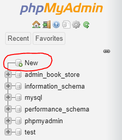

# Admin Book Store - API

### This project is for Demo purposes only.

## How to Operate

#### Step 1: Clone Repository
First we'll need to clone the repository to acquire certain files. You could do this by:
````
git clone https://github.com/LouKeen/admin-book-store
````
#### Step 2: Build
After cloning, we could now build the project. You could do this by:

Windows
````
gradlew build
````

Mac/Linux
````
./gradlew build
````
#### Step 3: Run Xampp
If you plan to use docker skip to step 5. 
For those who will not use docker start Xampp and run Apache and MySQL.


#### Step 4: Create Database
After running Xampp and starting Apache and MySQL. 
Open you browser and go to `http://localhost/phpmyadmin/`
On your left you'll see new. 
Click it then create a database with name `admin_book_store`



#### Step 5: Run
For running, we have 2 different ways of doing so. 

Docker: `docker-compose up`

Non-Docker: `java -jar build/libs/book-0.0.1-SNAPSHOT.jar`

## API Documentation

### Book
| Request Method | Path | JSON Request Body ( if any ) | Response | Description |
| ---------------| ---- | ---------------------------- | -------- |------------ |
| GET | http://localhost:8080/api/book | | { "status": "OK", "message": "Successful in getting books", "result": {[{"id": 1, "name": "Book 1", "description": "Desc", "categories": []}]} | Get list of all books |
| GET | http://localhost:8080/api/book/{bookId} | | { "status": "OK", "message": "Successful in getting books", "result": [{"id": 1, "name": "Book 1", "description": "Desc", "categories": []}]} | Get a book based on Id |
| ADD | http://localhost:8080/api/book/add | { "books": [{ "name": "Book 3", "description": "Desc" }, { "name": "Book 4", "description": "Desc"} | { "status": "CREATED", "message": "Successful in creating book/s", "result": ""} | Add book/s |
| PUT | http://localhost:8080/api/book/{bookId}?name=&description=&categoryIds=[] | | { "status": "CREATED", "message": "Successful in creating book", "result": ""} | Update a book based on Id |
| DELETE | http://localhost:8080/api/book/{bookId} | | { "status": "CREATED", "message": "Successful in creating book", "result": ""} | Delete a book based on Id |
| DELETE | http://localhost:8080/api/book/delete?bookIds=[] | | { "status": "CREATED", "message": "Successful in creating book", "result": ""} | Delete books based on Ids |

### Book Category
| Request Method | Path | JSON Request Body ( if any ) | Response | Description |
| ---------------| ---- | ---------------------------- | -------- |------------ |
| GET | http://localhost:8080/api/bookCategory | | { "status": "OK", "message": "Successful in getting book categories", "result": {[{"id": 1, "name": "Category 1", "description": "Desc"}]} | Get list of all categories |
| GET | http://localhost:8080/api/bookCategory/{bookCategoryId} | | { "status": "OK", "message": "Successful in getting book category", "result": {"id": 1, "name": "Category 1", "description": "Desc"}} | Get a book category based on Id |
| ADD | http://localhost:8080/api/bookCategory/add | { "booksCategories": [{ "name": "Category 3", "description": "Desc" }]} | { "status": "CREATED", "message": "Successful in creating book category/ies ", "result": ""} | Add bookcategories |
| PUT | http://localhost:8080/api/bookCategory/{bookId}?name=&description= | | { "status": "OK", "message": "Successful in updating book category ", "result": ""} | Update a book based on Id |
| DELETE | http://localhost:8080/api/bookCategory/{bookId} | | { "status": "OK", "message": "Successful in deleting book category ", "result": ""} | Delete a book category based on Id |
| DELETE | http://localhost:8080/api/bookCategory/delete?bookCategoryIds=[] | | { "status": "OK", "message": "Successful in deleting book category ", "result": ""} | Delete book categories based on Ids |

## API Documentations Links

### Postman
https://www.getpostman.com/collections/be232d1cae1665a27b30

### Swagger
http://localhost:8080/swagger-ui.html#/